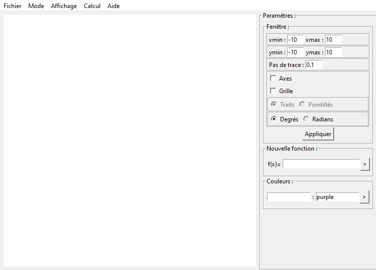

# Python-Fonctions-Graph

This is a program that allows you to draw the representative curve of functions and do some calcul on it.
## Features
- Creating function
- Save and load graphs
- Drawing on the graph
- Calculate the image of a function
- Calculate an antecedent of a function
- Calculate the minimum of a function
- Calculate the maximum of a function
- Calculate the tangent of a function
## Installation
1. Download the repository by clicking on `Code > Download ZIP`
2. Extract the ZIP file
3. Run `main.pyw`
## Requirements
- Python 3.7
- Python tkinter library
- Python math library
- Python os library
- Python PIL library
- Python time library
## Usage
In `Affichage` in the menu bar you can show hidden panels.